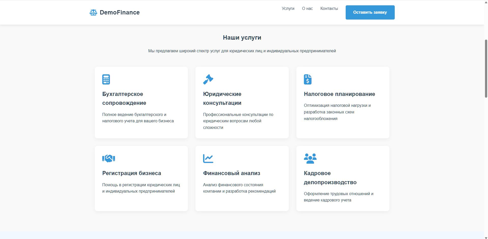
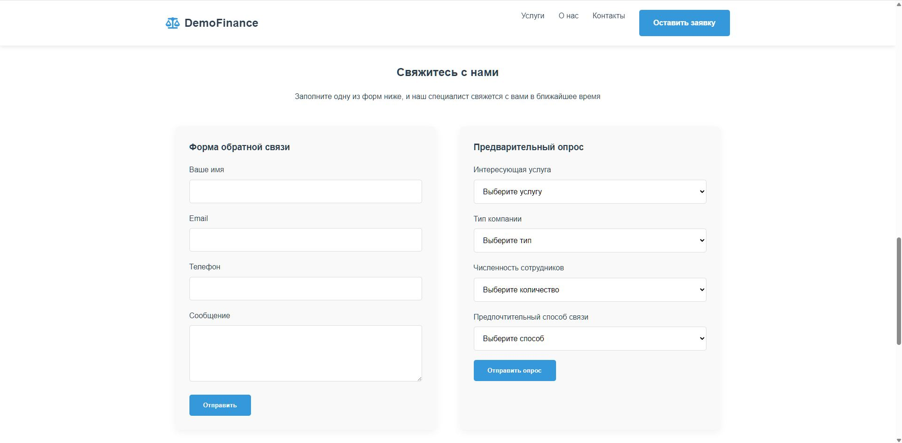

# 💼 DemoFinance — Демо сайт бухгалтерских и юридических услуг

Демонстрационный сайт компании, предоставляющей **бухгалтерские, налоговые и юридические услуги**.  
Создан в учебных и демонстрационных целях для показа структуры корпоративного лендинга и приёмов современной адаптивной вёрстки.

🔗 **Онлайн демо:** [Посмотреть на GitHub Pages](https://hoadf.github.io/DemoFinance/)  
💾 **Исходный код:** [Репозиторий на GitHub](https://github.com/hoadf/DemoFinance)

---

## 🖼️ Превью

---

## 📸 Скриншоты

| Главная | Услуги | Контакты |
|----------|---------|-----------|
|  |  |  |

---

## 💡 О проекте

**DemoFinance** — демонстрационный проект корпоративного сайта консалтинговой компании.  
Он показывает пример современного лендинга для сферы финансов, бухгалтерии и права.

Основные разделы сайта:
- геро-блок с привлекательным баннером и CTA-кнопкой;  
- секция с основными услугами;  
- описание компании и команды;  
- интерактивные формы обратной связи и опроса;  
- раздел контактов с картами и ссылками;  
- адаптивная вёрстка для мобильных устройств.

---

## 🧩 Технологии

- **HTML5** — структура и семантика контента  
- **CSS3 (Flexbox / Grid)** — адаптивная стилизация и оформление  
- **JavaScript (ES6)** — формы, плавная прокрутка и анимация появления секций  

---

## 🖥️ Особенности

- Плавная анимация появления блоков при прокрутке  
- Универсальная цветовая схема (синий + серый)  
- Фиксированное меню навигации  
- Адаптивность для планшетов и смартфонов  
- Полностью автономный сайт (без серверной части)

---

## 📤 Хостинг

Сайт размещён на **GitHub Pages**  
и работает локально без необходимости в сервере.

---

## 📄 Лицензия

Проект распространяется под лицензией [MIT](LICENSE).  
Разрешено использование кода в **учебных и демонстрационных целях** с указанием автора.

---

✉️ **Автор проекта:** *HOADF*  
💬 **Направление:** веб-разработка, интеграция ChatGPT, автоматизация и визуализация в Blender.
